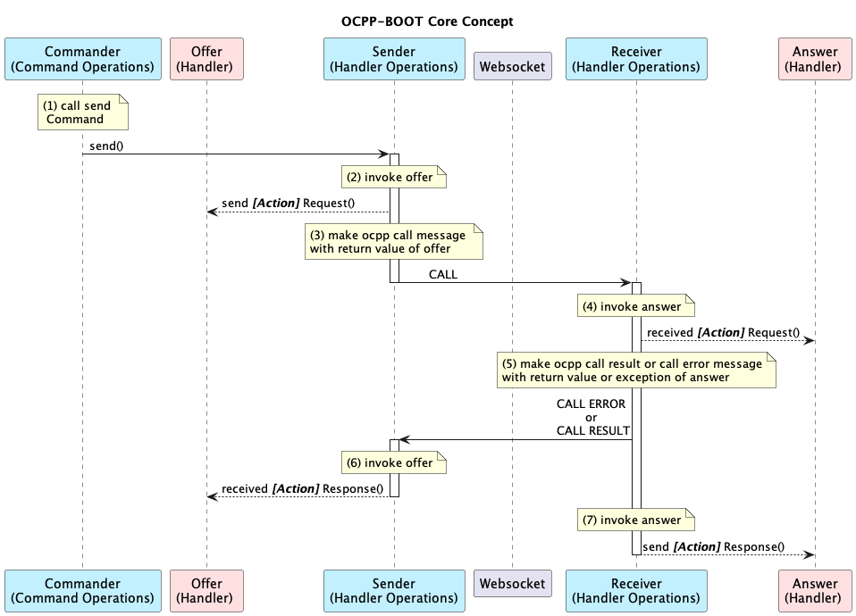

# ocpp-boot-client
OCPP client sample implementation with spring-boot. 

All messages for all versions of OCPP are written in Java. 

If you want to customize a businiss logic, implement the corresponding client handler.


# Usage 

```bash
./mvnw spring-boot:run
```


# Admin UX (Preparing)

> http://localhost:8082


# Customize Handler    

```java
import io.u2ware.ocpp.v2_1.handlers.DataTransfer.ChargingStationHandler; //-> 1.
import io.u2ware.ocpp.v2_1.exception.ErrorCodes; //-> 3.

@Component //-> 2.
public class MyDataTransfer implements ChargingStationHandler { //-> 1.

    @Override/** DataTransfer [1/4] */
    public DataTransferRequest sendDataTransferRequest(
        String id, Map<String, Object> req) {
        return DataTransferRequest.builder().build();
    }

    @Override/** DataTransfer [3/4] */
    public void receivedDataTransferResponse(
        String id, DataTransferResponse res, ErrorCode err) {
    }

    @Override/** DataTransfer [2/4] */
    public DataTransferResponse receivedDataTransferRequest(
        String id, DataTransferRequest req) {
        if(ObjectUtils.isEmpty(req)) { // your logic...
            throw ErrorCodes.GenericError.exception("your error message"); //-> 3.
        }
        return DataTransferResponse.builder().build();
    }

    @Override/** DataTransfer [4/4] */
    public void sendDataTransferResponse(
        String id, DataTransferResponse res, ErrorCode err) {
    }
}
```
1. Implement a Client Handler according to OCPP messages. 
2. Declare @Component so that 'ocppInitializer' scans the beans.
3. <i>OCPP CALL ERROR</i> messages can be sent by throwing an error code. 

# Test without I/O

```java
import io.u2ware.ocpp.v2_1.messaging.CSMSCommandTemplate; //-> 1.
import io.u2ware.ocpp.client.MockWebSocketHandlerInvoker; //-> 2.

@SpringBootTest
class MyDataTransferHandlerTests {

    protected @Autowired ApplicationContext ac;

    protected @Autowired ChargingStationCommandTemplate clientTemplate;

    @Test
    void context1Loads() throws Exception {

        /////////////////////////////////////
        // Mock Object
        /////////////////////////////////////
        CSMSCommandTemplate mockServerTemplate 
            = new CSMSCommandTemplate("mockServerTemplate"); //-> 1.

        MockWebSocketHandlerInvoker.of(ac)
            .connect(clientTemplate, mockServerTemplate); //-> 2.

        Thread.sleep(1000);	

        /////////////////////////////////////
        // Test without I/O
        /////////////////////////////////////
        ChargingStationCommand command 
            = ChargingStationCommand.ALL.DataTransfer.build();
        clientTemplate.send(command); //-> 3
        
        Thread.sleep(1000);
    }
}

```
1. Make mock server object.
2. Connecting mock object with your client bean. 
3. send client command.


# Customize Usecase    
```java
@Component
public class SecurityA02ClientHandler implements 
    TriggerMessage.ChargingStationHandler,
    SignCertificate.ChargingStationHandler, 
    CertificateSigned.ChargingStationHandler 
    {

    protected @Autowired ChargingStationCommandOperations ocppTemplate; //

    @Override
    public String usecase() {
        return "A02"; //
    }

    @Override/** TriggerMessage [2/4]  */
    public TriggerMessageResponse receivedTriggerMessageRequest(
        String id, TriggerMessageRequest req) {
        return TriggerMessageResponse.builder().build();
    }

    @Override/** TriggerMessage [4/4]  */
    public void sendTriggerMessageResponse(
        String id, TriggerMessageResponse res, ErrorCode err) {
        ///////////////////////////////////////////////////////////////
        // You can send other OCPP CALL messages using 'ocppTemplate'.
        ///////////////////////////////////////////////////////////////
        ChargingStationCommand command = 
            ChargingStationCommand.ALL.SignCertificate.buildWith("A02");
        ocppTemplate.send(id, command); //
    }

    @Override/** SignCertificate [1/4]  */
    public SignCertificateRequest sendSignCertificateRequest(
        String id, Map<String, Object> req) {
        return SignCertificateRequest.builder().build();
    }

    @Override/** SignCertificate [3/4]  */
    public void receivedSignCertificateResponse(
        String id, SignCertificateResponse res, ErrorCode err) {
    }

    @Override/** CertificateSigned [2/4]  */
    public CertificateSignedResponse receivedCertificateSignedRequest(
        String id, CertificateSignedRequest req) {
        return CertificateSignedResponse.builder().build();
    }   

    @Override/** CertificateSigned [4/4]  */
    public void sendCertificateSignedResponse(
        String id, CertificateSignedResponse res, ErrorCode err) {
    }
}
```

# @EnableOcppClient 

```java
@SpringBootApplication
@EnableOcppClient(                        //-> 3. 
    version = OCPPVersion.V2_1,           //-> 2. 
	uri = "ws://localhost:8081/your_ocpp" //-> 1. 
)
public class Application {
	public static void main(String[] args) {
		SpringApplication.run(Application.class, args);
	}
}
```
1. URI. websocket URI of ocpp server 

2. versions. V2_1, V2_0_1, V1_6

3. [@EnableOcppClient]() automatically registers the following beans:


    * v2.1

	|beanName|beanClass|Description|
	|------|:---|---|
	|ocppTemplate | [ChargingStationSession]()| An object that can offer a [ChargingStationCommand]().|


    * v2.0.1

	|beanName|beanClass|Description|
	|------|:---|---|
	|ocppTemplate | [ChargingStationSession]()| An object that can offer a [ChargingStationCommand]().|


    * v1.6

	|beanName|beanClass|Description|
	|------|:---|---|
	|ocppTemplate | [ChargePointSession]() | An object that can offer a [ChargePointCommand]().|


# Core Concept 


* v2.1

|participant|object|
|------|:---|
|Commander |[CSMSSession]()  or [ChargingStationSession]() |
|Offer | [CSMSHandler]() or [ChargingStationHandler]() |
|Sender |[CSMS]() or [ChargingStation]() |
|Receiver |[CSMS]() or [ChargingStation]() |
|Answer | [CSMSHandler]() or [ChargingStationHandler]() |


* v2.0.1

|participant|object|
|------|:---|
|Commander |[CSMSSession]()  or [ChargingStationSession]() |
|Offer | [CSMSHandler]() or [ChargingStationHandler]() |
|Sender |[CSMS]() or [ChargingStation]() |
|Receiver |[CSMS]() or [ChargingStation]() |
|Answer | [CSMSHandler]() or [ChargingStationHandler]() |


* v1.6

|participant|object|
|------|:---|
|Commander |[CentralSystemSession]()  or [ChargePointSession]() |
|Offer | [CentralSystemHandler]() or [ChargePointHandler]() |
|Sender |[CentralSystem]() or [ChargePoint]() |
|Receiver |[CentralSystem]() or [ChargePoint]() |
|Answer | [CentralSystemHandler]() or [ChargePointHandler]() |


